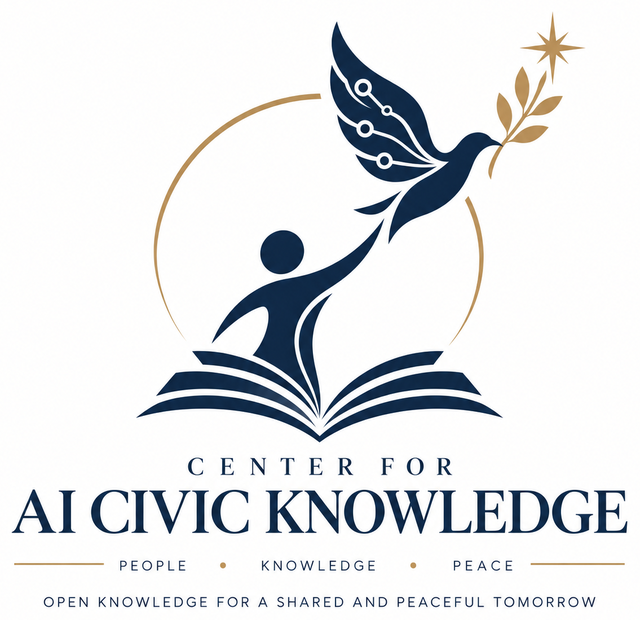

<p align="center">
  
</p>

<h1 align="center">GrantThai</h1>

<p align="center"><strong>ใส่ข้อมูลทางเดียว &nbsp;·&nbsp; ได้ร่างไฟล์เดียว &nbsp;·&nbsp; ตรวจแล้วนำไปกรอก NRIIS</strong></p>

<p align="center">
  
  
  
  
</p>

<p align="center">
  <a href="README.en.md"><b>English</b></a> &nbsp;·&nbsp;
  <a href="AGENTS.md">สำหรับ AI ผู้ช่วย</a> &nbsp;·&nbsp;
  <a href="docs/th/">คู่มือภาษาไทย</a>
</p>

<p align="center">
  
  
  
  
  
</p>

## GrantThai คืออะไร

เครื่องมือเปิดที่ช่วยเปลี่ยน **ปัญหาจริงที่คุณรู้ดี** ให้เป็น **ร่างข้อเสนอโครงการวิจัย** ที่เรียบเรียงไว้ในไฟล์เดียว เพื่อให้คุณตรวจทาน แล้วคัดลอกไปกรอกในระบบ NRIIS ด้วยตนเอง

```
project.yaml  ──►  grantthai build  ──►  build/NRIIS_SUBMISSION.md
  (ข้อมูลของคุณ)                            (ร่างไฟล์เดียว รอคุณตรวจ)
```

- **ความรู้เป็นของคุณ** ประสบการณ์ ข้อมูล และดุลยพินิจของนักวิจัยคือต้นทาง
- **AI เป็นเพียงผู้ช่วยเรียบเรียง** ถามคุณ ร่างให้ ตรวจโครงสร้าง แต่ไม่รับรองความรู้ และไม่แต่งข้อเท็จจริงเรื่องทุน
- **ทุกช่องตรวจสอบย้อนกลับได้** อะไรยังขาด ระบบบอกว่า `NEEDS_INPUT` อะไรยังไม่ยืนยันกับเอกสารทางการ ระบบบอกว่า `NEEDS_VERIFICATION`

> **GrantThai ลดกำแพงในการเข้าสู่งานวิจัย ไม่ได้ลดมาตรฐานของงานวิจัย**

## เริ่มใช้ใน 3 นาที

```bash
pip install -e .                                   # ติดตั้งครั้งเดียว
grantthai init project.yaml --project-id MY-001    # เริ่มโครงการใหม่
grantthai set CORE.GENERAL.TITLE_TH "ชื่อโครงการ"   # กรอกข้อมูลทีละช่อง
grantthai validate project.yaml                    # ตรวจว่าครบและสอดคล้องกันไหม
grantthai build project.yaml                       # ได้ build/NRIIS_SUBMISSION.md
```

## ใช้ร่วมกับ AI ของคุณ

ให้ AI ที่คุณใช้อยู่แล้ว ไม่ว่าค่ายไหน เป็นคนสัมภาษณ์และกรอกให้ ส่วนคุณเป็นคนยืนยัน

| ช่องทาง | เหมาะกับ | เริ่มที่ |
|---|---|---|
| **สกิล** | Claude Code, Codex, Gemini CLI และ AI แชททั่วไป | [`skills/grantthai/SKILL.md`](skills/grantthai/SKILL.md) |
| **MCP** | โปรแกรม AI ที่รองรับ MCP เช่น Claude Desktop | [`docs/mcp.md`](docs/mcp.md) |
| **API** | ChatGPT Actions และระบบอัตโนมัติ | [`docs/api.md`](docs/api.md) |

ทุกช่องทางให้ผลลัพธ์เดียวกัน คือไฟล์เดียวกันแบบไบต์ต่อไบต์ และทุกค่าที่ AI ร่างจะถูกระบุว่าเป็นร่างของ AI รอคุณยืนยันเสมอ

## ระบบนิเวศที่ GrantThai อยู่

```
ประสบการณ์จริงของผู้คน ──► แปลงเป็นโจทย์วิจัย ──► ออกแบบวิธีวิจัย ──► จัดให้ตรงทุน ──► ร่างข้อเสนอสำหรับกรอก NRIIS
                                        └────────────── GrantThai ทำส่วนนี้ ──────────────┘
```

รายละเอียดทั้งระบบ ผู้เกี่ยวข้อง และขอบเขตที่ GrantThai **ไม่ทำ** อยู่ที่ [`docs/ecosystem.md`](docs/ecosystem.md)

## ผู้พัฒนา

<table>
<tr>
<td width="140" align="center"></td>
<td>
<b>เยาฮารี หละตี</b> (Yaoharee Lahtee) · ORCID <a href="https://orcid.org/0009-0005-3861-0626">0009-0005-3861-0626</a><br>
<b>อารยานิกะห์ วิสาหกิจเพื่อสังคม</b> · ARAYA NIKAH SOCIAL ENTERPRISE CO.<br>
ผลงานร่วมกับ <b>ศูนย์ความรู้พลเมืองปัญญาประดิษฐ์</b> (Center for AI Civic Knowledge) ซึ่งเป็นศูนย์ของอารยานิกะห์ วิสาหกิจเพื่อสังคม<br><br>
<i>พัฒนาเพื่อให้เป็นประโยชน์กับคนไทยทุกคนในการพัฒนาความรู้</i>
</td>
</tr>
</table>

โค้ดใช้สัญญาอนุญาต Apache-2.0 เอกสารใช้ CC BY 4.0 · **โลโก้สงวนสิทธิ์** ไม่อยู่ภายใต้สัญญาอนุญาตทั้งสอง · รายละเอียดใน [`LICENSE`](LICENSE) และ [`NOTICE`](NOTICE)

## ประกาศ

GrantThai is an independent, unofficial project. It is NOT affiliated with, endorsed by, sponsored by, or officially connected to NRCT, TSRI, any PMU, or NRIIS. / GrantThai เป็นโครงการอิสระ ไม่เป็นทางการ และไม่ผูกพันกับ วช. สกสว. หน่วยบริหารจัดการทุน (PMU) ใด ๆ หรือระบบ NRIIS

ชื่อช่องและลำดับหน้าจอของ NRIIS ในระบบนี้ยังเป็น **ตัวเลือกที่รอยืนยันกับเอกสารทางการ** ทั้งหมด โปรดตรวจกับประกาศทุนฉบับปัจจุบันก่อนยื่นทุกครั้ง

<p align="center">
  
  
  
  
  
</p>

---

<details>
<summary><b>รายละเอียดเชิงเทคนิค</b> (เวอร์ชัน, แผนที่คลัง, การกำกับดูแล, สัญญาอนุญาต, การเปิดเผยบทบาท AI)</summary>

### Philosophy

1. "GrantThai lowers the entry barrier to research, not the standard of research."
2. "Toledo connects lived experience with academic knowledge through
   translation — by people, and optionally with AI assistance — while
   evidence, methodology, and human expertise remain the gates to
   verifiable knowledge."
   *(Sentence 2 wording: founder ruling K1, 2026-09-25; see
   `GOVERNANCE.md`, "Founder decisions log". Translation may always be done
   by a person alone; AI assistance is optional at every step.)*

**GrantThai contains no Toledo-registered equations and no proofs.** "Toledo"
here refers only to the conceptual framework (lived experience ↔ academic
knowledge, human-gated). See `docs/lineage.md` for pointers to the public
Toledo and glosa repositories. No Toledo content is copied into this
repository.

---

### The one-input, one-output contract

GrantThai's entire purpose is one pipeline:

```
ONE INPUT                    ONE COMMAND                 ONE OUTPUT
project.yaml  ------------>  grantthai build  --------->  build/NRIIS_SUBMISSION.md
(the only canonical input)                                (a single, self-contained,
                                                             ready-to-copy-paste file)
```

- **One input.** `project.yaml` is the only input `grantthai build` reads.
  The offline web form, the Markdown forms, the Citizen/Expert
  questionnaires, `grantthai init`, and any optional AI assistant are all
  just *editors* of that one file. Your name, team and institution used in
  the submission are stored in `project.yaml` too (`PROFILE.*` fields); an
  optional local `profile.yaml` can pre-fill them while you edit, but
  `build` never reads it. The fund profile is a bound reference named inside
  `project.yaml`, not a second input.
- **One command.** `grantthai build <project.yaml>`.
- **One output.** `build/NRIIS_SUBMISSION.md` — one self-contained file
  containing every field grouped by NRIIS tab, plus a readiness summary
  (`BLOCK` / `REVIEW` / `INFO` findings, `NEEDS_INPUT`,
  `NEEDS_VERIFICATION`) at the top. No second GrantThai-generated file is
  needed to enter data into NRIIS; supporting documents for the attachments
  tab are your own files, listed with their status. (Citizen Mode's
  optional `--concept-note` output is a *separate*, clearly optional
  artifact for people who are not yet build-ready for NRIIS at all — it is
  never part of the NRIIS entry path itself.)

The full contract is written down in
[`spec/contracts/one-input-one-output.md`](./spec/contracts/one-input-one-output.md)
and is guarded by `tools/ci/check_one_output.py` (structural checks now;
the renderer-output check is added when the renderer ships).

### Commands

Working in v0.1.0 (`grantthai --help`):

| Command | Purpose |
|---|---|
| `grantthai init [PATH] [--project-id ID] [--fund ID]` | write a blank `project.yaml` (refuses to overwrite) |
| `grantthai set FIELD_ID VALUE [--ai --tool NAME]` | set one field; the result is always `DRAFT` (an AI value is `ai_draft`/`INFERENCE`) |
| `grantthai fields [--tab TAB] [--required]` | list the fields in NRIIS order |
| `grantthai validate [PATH] [--json] [--as-of DATE]` | run the rules (BLOCK/REVIEW/INFO report); exit 1 on any BLOCK |
| `grantthai explain RULE_ID` | plain-language explanation of a rule |
| `grantthai build [PATH] [--out DIR] [--as-of DATE]` | render the one output `build/NRIIS_SUBMISSION.md` |
| `grantthai-mcp --root DIR` | MCP server over the same functions |
| `grantthai-api [--port N]` | local HTTP API over the same functions |

Deferred (founder scope, 2026-09-25): `fill --interactive`, `import-form`,
`fund check`/`fund stale` as separate commands, `export`, `doctor`, and the
Citizen Mode, review and lock commands (`interview`, `review`,
`accept-mapping`/`reject-mapping`, `build --concept-note`, `lock`, `diff`).

---

### Ecosystem at a glance

GrantThai bridges exactly four stages: **Problem/Knowledge → Researchable
project → Funding-aligned project → NRIIS-ready project**, with the one
canonical `project.yaml` in and the one canonical
`build/NRIIS_SUBMISSION.md` out. It sits between two larger ecosystems —
the founder's conceptual Toledo Open Research & Knowledge Ecosystem
(lived experience ↔ academic knowledge, human-gated translation) and the
national/sector Thailand Research & Innovation ecosystem (need → policy →
fund/PMU → project → output → user → outcome → impact). GrantThai never
submits to NRIIS, never decides eligibility, and never grants any
official status — those stay with humans, the bound fund profile, and
NRIIS itself. Full diagrams (with GrantThai's box and its four stages
marked in both ecosystems), the actor table, flows, and
sibling-infrastructure pointers (Toledo, glosa, main.hub) are in
[`docs/ecosystem.md`](./docs/ecosystem.md) (TH+EN) and the machine-readable
[`ecosystem/ecosystem.yaml`](./ecosystem/ecosystem.yaml).

---

### ผู้พัฒนา / Developer

- **Developer / maintainer:** Yaoharee Lahtee (เยาฮารี หละตี), ORCID
  [0009-0005-3861-0626](https://orcid.org/0009-0005-3861-0626)
- **Developing organisation:** ARAYA NIKAH SOCIAL ENTERPRISE CO.
  (อารยานิกะห์ วิสาหกิจเพื่อสังคม)
- **Purpose:** "พัฒนาเพื่อให้เป็นประโยชน์กับคนไทยทุกคนในการพัฒนาความรู้" /
  "Developed to benefit every Thai person in developing knowledge."
- **Joint work:** ผลงานร่วมกับ ศูนย์ความรู้พลเมืองปัญญาประดิษฐ์ ซึ่งเป็นศูนย์ของ
  อารยานิกะห์ วิสาหกิจเพื่อสังคม (a joint work with
  ศูนย์ความรู้พลเมืองปัญญาประดิษฐ์, a centre of ARAYA NIKAH SOCIAL
  ENTERPRISE CO.).

This developer/organisation statement is a statement of who builds and
maintains GrantThai. It does **not** imply any affiliation with, or
endorsement by, NRCT, TSRI, any PMU, or NRIIS — see `NOTICE`.

---

### AI is optional everywhere (parity table)

Every AI-assisted convenience has a human-only equivalent that ships in the
same or an earlier version. See `spec/common/parity.yaml` for the
machine-readable version (populated from v0.3 onward; empty in Phase 0).

| AI feature (v0.3+) | Human-only equivalent (ships v0.1/v0.2) |
|---|---|
| intake assistant | Citizen questionnaire + `citizen_to_core.yaml` |
| field drafting | `webform/`, `forms/*.md`, `grantthai fill --interactive`, `guidance{th,en}` |
| LocalTerm → AcademicConcept proposal | glossary lookup + human `proposesMapping`, or "own words + CONCEPT NEEDS_INPUT" |
| critique | `grantthai validate` + a named expert review record |
| fund-fit check | `grantthai fund check` |
| handoff package | `NRIIS_SUBMISSION.md` (the one output); `GRANTTHAI_STANDALONE.md` is reference documentation |
| MCP / browser-assist (v0.4) | human copy/paste |

AI output is never `SOURCE` and never moves a field above `DRAFT` on its
own. AI critique is never recorded as an independent review of a research
project. See `spec/common/status.yaml` and
`spec/common/status_permissions.yaml`.

---

### What this repository is (v0.1.0)

On top of the Phase 0 scaffold (directory layout, governance and policy
documents, data contracts (JSON Schema and YAML), the field registry
derived from the handoff package (`registry/fields.jsonl`, every Thai label
`NEEDS_VERIFICATION`), the validation rule catalog as data
(`validators/rules.yaml`), CI guards with seeded failing fixtures, and
documentation), v0.1.0 adds the working engine (`src/grantthai/core`,
`validators`, `render`, `api_py.py`, `cli`) and three AI-facing wrappers:
the agent skill (`skills/grantthai/`), the MCP server
(`src/grantthai/mcp/`) and the local HTTP API (`src/grantthai/api/`). The
web form logic and launchers are deferred. See `GRANTTHAI_STANDALONE.md` for the full
system/architecture description, `docs/design/PLAN.md` for the design plan
(historical record), and `docs/deviations.md` for where this scaffold
intentionally departs from the original handoff package.

### Repository map

- `spec/` — JSON Schema and YAML contracts.
- `registry/`, `mappings/`, `validators/` — field registry, section-to-tab
  table, rule catalog (data).
- `docs/th/`, `docs/en/` — role-specific guides (stubs in Phase 0).
- `docs/design/PLAN.md` — the founder's design plan (historical record).
- `skills/grantthai/` — the agent skill (SKILL.md, references, helper script).
- `src/grantthai/` — the library (`api_py.py` is the one Python surface); `core`, `validators`, `review`,
  `fund`, `mapping`, `render`, `interview`, `cli` are AI-free by construction
  (CI enforces this — see `.github/workflows/ci.yml`, no-AI-import guard).
  `assist`, `mcp`, `api` are optional and never load in the core path.
- `funds/` — dated, sourced fund-call profiles. `funds/example/` ships a
  clearly `FICTIONAL` profile for testing; never a real one in Phase 0.
- `tests/` — positive/negative fixtures, guard tests, and (from v0.1)
  golden files and one negative fixture per BLOCK rule.
- `.githooks/commit-msg` — rejects AI/vendor attribution trailers in commit
  messages. Run `git config core.hooksPath .githooks` after cloning.

### Governance and status vocabulary

See `GOVERNANCE.md`, `spec/common/status.yaml`, `spec/common/review_gates.yaml`.
In short: a "checked" or "verified" status always states *who* checked it
and *how independent* they were. Self-review renders as `AUTHOR_CHECKED`,
never as `VERIFIED`. Humans decide everything; AI proposes, never proves.

### Licensing

- Code (`src/`, `tools/`, `tests/`, `.githooks/`, `.github/`, `webform/`,
  `launchers/`, `pyproject.toml`, `.gitignore`): Apache-2.0.
- Everything else — documentation, specifications, ontology, templates and
  data (registry, mappings, rule catalog, fund profiles, ecosystem files):
  CC BY 4.0.

`REUSE.toml` is the authoritative per-path mapping, and `reuse lint` runs in
CI. See `LICENSE` and `LICENSES/`.

### Contact

See `SECURITY.md` and `CODE_OF_CONDUCT.md` (contact address: `NEEDS_INPUT`,
pending a founder-supplied non-personal address, decision K9).

---

### Core Epistemic Structure (role disclosure)

- **Core respondent / experience-based expert:** Yaoharee Lahtee.
- **Interactional expert:** None.
- **AI model(s) used (role only, not authorship):**
  - GPT-5.6-sol (OpenAI, via Codex) — co-drafting of the handoff package
    and overall picture with the author.
  - Claude Opus 5.5 — planning meeting chair/seats, adversarial gate
    review, drafting fixes.
  - Claude Sonnet 5 — scaffolding and verification.

  This footer and `docs/lineage.md` are the only places an AI model is
  named as having been used in producing this repository (other mentions
  are guard patterns, SDK package names in import-ban lists, tooling file
  names or guard-test fixtures). It is a role disclosure, not an
  authorship or credit line.


</details>
